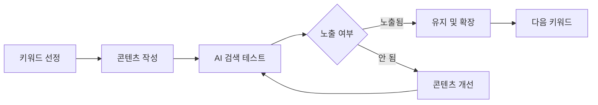

# AI 검색 최적화 전략 (제로 클릭 대응)

**버전**: 1.0.0
**작성일**: 2025-12-05
**적용 범위**: 엘리콘 웹사이트 + 유튜브 콘텐츠
**기반**: 트렌드코리아 2026 - 제로 클릭 트렌드

---

## 📋 목차

1. [제로 클릭 시대 이해](#제로-클릭-시대-이해)
2. [AI 검색 엔진 최적화 원칙](#ai-검색-엔진-최적화-원칙)
3. [웹사이트 최적화 전략](#웹사이트-최적화-전략)
4. [유튜브 콘텐츠 최적화 전략](#유튜브-콘텐츠-최적화-전략)
5. [키워드 전략](#키워드-전략)
6. [콘텐츠 구조화 가이드](#콘텐츠-구조화-가이드)
7. [측정 및 개선](#측정-및-개선)
8. [실행 체크리스트](#실행-체크리스트)

---

## 🎯 제로 클릭 시대 이해

### 제로 클릭이란?

> **"클릭 없이 AI가 직접 답변을 제공하는 검색 패러다임"**

```
전통적 검색 (SEO)
사용자 검색 → 검색 결과 10개 → 클릭 → 웹사이트 방문

제로 클릭 검색 (AI Search)
사용자 검색 → AI 직접 답변 → (클릭 없음)
```

### 주요 AI 검색 엔진

| AI 검색 | 특징 | 점유율 |
|---------|------|--------|
| **ChatGPT** | 대화형 AI, 상세한 설명 | 1위 |
| **Google Gemini** | 구글 통합, 실시간 정보 | 2위 |
| **Perplexity** | 출처 명시, 학술 검색 | 3위 |
| **Bing Copilot** | MS 생태계 통합 | 4위 |

### 마케팅 패러다임 전환

**기존 (SEO 시대)**:
- 검색 순위 = 트래픽
- 브랜드 파워 = 우선 노출
- 광고비 = 상위 랭킹

**현재 (AI Search 시대)**:
- **상품력 = AI 추천**
- **콘텐츠 품질 = 답변 포함 여부**
- **정보 구조화 = AI 이해도**

---

## 🤖 AI 검색 엔진 최적화 원칙

### 1. 직접적인 답변 제공 ⭐⭐⭐

**AI는 명확한 답변을 선호합니다.**

❌ **나쁜 예**:
```
엘리콘은 다양한 서비스를 제공하는 기업입니다.
궁금한 점이 있으시면 문의해주세요.
```

✅ **좋은 예**:
```
엘리콘 주요 서비스:
1. 마케팅파크: 브랜딩 + 웹사이트 구축 통합 솔루션
2. 화성인력소: 제조업 전문 인력 채용 플랫폼
3. 제이에스일렉트론: PCB 제조 전문 기업

문의: 02-XXX-XXXX (평일 9-18시)
```

### 2. 구조화된 데이터 ⭐⭐⭐

**AI는 구조화된 정보를 선호합니다.**

```markdown
# 좋은 구조 예시

## 서비스명
**대상**: 중소기업 대표
**기간**: 2주 ~ 4주
**비용**: 300만원 ~ 800만원
**포함 항목**:
- 항목 1
- 항목 2
- 항목 3

## 문의 방법
- 전화: 02-XXX-XXXX
- 이메일: info@elicon.co.kr
- 카카오톡: @엘리콘
```

### 3. 명확한 키워드 사용 ⭐⭐⭐

**검색 의도와 일치하는 키워드 필수**

```
사용자 검색: "중소기업 브랜딩 비용"

✅ 포함해야 할 키워드:
- "중소기업 브랜딩"
- "브랜딩 비용"
- "브랜딩 가격"
- "견적"

❌ 피해야 할 모호한 표현:
- "합리적인 가격"
- "경쟁력 있는 비용"
- "상담 후 결정"
```

### 4. 신뢰성 강화 ⭐⭐

**AI는 신뢰할 수 있는 정보원을 선호합니다.**

```markdown
신뢰성 지표:
- [ ] 구체적인 숫자 (실적, 고객 수, 프로젝트 수)
- [ ] 날짜 및 업데이트 정보
- [ ] 연락처 및 위치 정보
- [ ] 고객 후기 (구체적)
- [ ] 관련 자격증/인증

예시:
"2024년 기준 350개 기업 브랜딩 완료 (누적)"
"평균 고객 만족도 4.8/5.0 (최근 6개월)"
```

---

## 🌐 웹사이트 최적화 전략

### 홈페이지 구조 개선

**현재 상태 분석**:
- 01_2_elicon_homepage: Next.js 16 + React 19
- 2025 웹 트렌드 35개 적용 완료
- Lighthouse: A99, BP100, SEO100

**AI 검색 최적화 추가 작업**:

#### 1. 메타데이터 강화

```typescript
// app/layout.tsx 또는 page.tsx

export const metadata: Metadata = {
  title: '엘리콘 | 중소기업 브랜딩 전문 - 웹사이트 제작부터 마케팅까지',
  description: '중소기업 맞춤 브랜딩 솔루션. 웹사이트 제작 300만원부터. 평균 2-3주 완성. 350개 기업 완료. 문의: 02-XXX-XXXX',
  keywords: [
    '중소기업 브랜딩',
    '웹사이트 제작',
    '브랜딩 비용',
    '마케팅 대행',
    '엘리콘',
  ],
  openGraph: {
    title: '엘리콘 | 중소기업 브랜딩 전문',
    description: '웹사이트 제작 300만원부터. 2-3주 완성. 350개 기업 신뢰.',
    images: ['/og-image.jpg'],
  },
  // AI 검색 최적화 (신규)
  other: {
    'ai-search-optimized': 'true',
    'target-audience': '중소기업 대표, 마케팅 담당자',
    'service-category': '브랜딩, 웹사이트 제작, 마케팅',
  },
}
```

#### 2. FAQ 섹션 추가 ⭐⭐⭐

**AI는 FAQ를 선호합니다.**

```tsx
// app/_components/home/FAQ.tsx

const faqs = [
  {
    question: "중소기업 브랜딩 비용은 얼마인가요?",
    answer: "기본 브랜딩 패키지는 300만원부터 시작합니다. 포함 항목: 로고 디자인, 명함, 웹사이트 기본형. 평균 제작 기간은 2-3주입니다."
  },
  {
    question: "웹사이트 제작 기간은 얼마나 걸리나요?",
    answer: "기본 웹사이트는 2주, 고급형은 3-4주 소요됩니다. 디자인 확정 후 개발 시작하며, 수정은 2회 무료 제공됩니다."
  },
  {
    question: "마케팅파크란 무엇인가요?",
    answer: "브랜딩 + 웹사이트 + 마케팅을 통합한 올인원 솔루션입니다. 중소기업이 여러 업체를 거치지 않고 한 곳에서 모든 서비스를 받을 수 있습니다."
  },
  // ... 10개 이상 FAQ 추천
]

export default function FAQ() {
  return (
    <section className="faq-section">
      <h2>자주 묻는 질문</h2>
      {faqs.map((faq, i) => (
        <details key={i}>
          <summary>{faq.question}</summary>
          <p>{faq.answer}</p>
        </details>
      ))}
    </section>
  )
}
```

#### 3. JSON-LD 구조화 데이터

```tsx
// app/layout.tsx

export default function RootLayout({ children }) {
  const jsonLd = {
    '@context': 'https://schema.org',
    '@type': 'LocalBusiness',
    name: '엘리콘(주)',
    description: '중소기업 브랜딩 및 웹사이트 제작 전문',
    address: {
      '@type': 'PostalAddress',
      addressLocality: '서울',
      addressCountry: 'KR',
    },
    telephone: '02-XXX-XXXX',
    priceRange: '300만원 - 800만원',
    areaServed: {
      '@type': 'Country',
      name: '대한민국',
    },
    // FAQ Schema
    mainEntity: [
      {
        '@type': 'Question',
        name: '중소기업 브랜딩 비용은 얼마인가요?',
        acceptedAnswer: {
          '@type': 'Answer',
          text: '기본 브랜딩 패키지는 300만원부터 시작합니다...',
        },
      },
      // ... more FAQs
    ],
  }

  return (
    <html>
      <head>
        <script
          type="application/ld+json"
          dangerouslySetInnerHTML={{ __html: JSON.stringify(jsonLd) }}
        />
      </head>
      <body>{children}</body>
    </html>
  )
}
```

#### 4. 명확한 CTA (Call-to-Action)

```tsx
// AI 검색에서 "엘리콘 문의 방법"으로 검색 시 노출될 정보

<section id="contact">
  <h2>문의 방법</h2>

  <div className="contact-methods">
    <div>
      <h3>전화 문의</h3>
      <p><strong>02-XXX-XXXX</strong></p>
      <p>평일 9:00 - 18:00 (점심 12-13시)</p>
    </div>

    <div>
      <h3>이메일 문의</h3>
      <p><strong>info@elicon.co.kr</strong></p>
      <p>24시간 접수, 평일 24시간 내 답변</p>
    </div>

    <div>
      <h3>카카오톡 상담</h3>
      <p><strong>@엘리콘</strong></p>
      <p>실시간 상담 가능 (평일 9-18시)</p>
    </div>
  </div>

  <div className="visit-info">
    <h3>방문 상담</h3>
    <p>주소: 서울시 XX구 XX로 XX</p>
    <p>방문 상담은 사전 예약 필수</p>
    <p>예약: 전화 또는 카카오톡</p>
  </div>
</section>
```

---

## 🎥 유튜브 콘텐츠 최적화 전략

### 제목 최적화 ⭐⭐⭐

**AI 검색에 노출되려면 키워드가 제목에 포함되어야 합니다.**

❌ **나쁜 예**:
```
"신화 이야기 #5"
"재미있는 그리스 신화"
"이번 주 신화 콘텐츠"
```

✅ **좋은 예**:
```
"제우스와 헤라의 결혼 | 그리스 신화 SE1_EP05"
"프로메테우스가 불을 훔친 이유 | 그리스 신화 완벽 해설"
"메두사의 저주 | 페르세우스 영웅 이야기 | 그리스 신화"
```

**제목 구조**:
```
[핵심 키워드] | [시리즈 정보] | [카테고리]
└─ AI 검색 노출   └─ 시청자 탐색    └─ 알고리즘 분류
```

### 설명란 최적화 ⭐⭐⭐

**처음 3줄이 AI 답변에 포함됩니다.**

```markdown
# 좋은 설명란 예시

제우스와 헤라의 결혼은 그리스 신화에서 가장 복잡한 이야기입니다.
이 영상에서는 제우스가 헤라를 유혹한 방법과 결혼 후 갈등을 다룹니다.
원전: 호메로스 일리아스, 헤시오도스 신통기 기반

📚 영상 구성:
00:00 - 인트로
00:15 - 제우스와 헤라의 첫 만남
01:30 - 결혼 과정
03:45 - 갈등과 화해
05:30 - 교훈 및 현대적 의미

🎯 핵심 키워드:
- 그리스 신화
- 제우스
- 헤라
- 신화 결혼 이야기
- 올림포스 12신

📖 참고 자료:
- 일리아스 (호메로스)
- 신통기 (헤시오도스)
- 그리스 로마 신화 (토마스 불핀치)

🔗 관련 영상:
- 제우스의 탄생: [링크]
- 올림포스 12신 소개: [링크]

#그리스신화 #제우스 #헤라 #신화이야기 #교육
```

### 챕터 활용 ⭐⭐

**AI가 특정 부분을 참조할 수 있도록 타임스탬프 제공**

```
00:00 - 인트로
00:15 - 제우스와 헤라의 첫 만남
01:30 - 제우스의 변신 전략
03:45 - 헤라의 반응
05:30 - 결혼식 장면
07:15 - 갈등의 시작
09:00 - 교훈 및 현대적 의미
```

### 해시태그 전략 ⭐⭐

```markdown
# 해시태그 우선순위

## 1순위 (필수):
#그리스신화 #신화 #신화이야기

## 2순위 (에피소드별):
#제우스 #헤라 #올림포스12신

## 3순위 (카테고리):
#교육 #스토리텔링 #역사

## 금지:
❌ 과도한 해시태그 (10개 초과)
❌ 무관한 해시태그 (#shorts #viral 등)
```

### 썸네일 텍스트 최적화

**AI는 썸네일 텍스트도 읽습니다 (OCR 기술)**

```
✅ 좋은 썸네일 텍스트:
- "제우스 vs 헤라"
- "불을 훔친 프로메테우스"
- "메두사의 저주"

❌ 나쁜 썸네일 텍스트:
- "충격적인 결말"
- "믿을 수 없는 반전"
- "EP05"
```

---

## 🔑 키워드 전략

### 엘리콘 핵심 키워드 맵

#### 웹사이트 제작 관련
```
메인 키워드:
- 중소기업 웹사이트 제작
- 웹사이트 제작 비용
- 반응형 웹사이트

롱테일 키워드:
- 중소기업 웹사이트 제작 비용 얼마
- 저렴한 웹사이트 제작 업체
- 2주 완성 웹사이트 제작
- Next.js 웹사이트 제작

지역 키워드:
- 서울 웹사이트 제작
- 강남 웹사이트 제작 업체
```

#### 브랜딩 관련
```
메인 키워드:
- 중소기업 브랜딩
- 브랜딩 대행
- 로고 디자인

롱테일 키워드:
- 중소기업 브랜딩 비용
- 브랜딩 패키지 가격
- 스타트업 브랜딩 전문
- 제조업 브랜딩

의도 기반 키워드:
- 브랜딩 어떻게 시작
- 브랜딩 필요한 이유
- 브랜딩 vs 마케팅 차이
```

#### 유튜브 콘텐츠 관련
```
메인 키워드:
- 그리스 신화
- 신화 이야기
- 신화 해설

롱테일 키워드:
- 그리스 신화 제우스 이야기
- 신화 쉬운 설명
- 신화 교훈

시리즈 키워드:
- 그리스 신화 시리즈
- SE1_EP01
- 올림포스 12신
```

### 키워드 리서치 도구

```bash
# 무료 도구
- Google Keyword Planner (기본)
- Answer the Public (질문 형식 키워드)
- Google Trends (트렌드 확인)

# 유료 도구 (선택)
- Ahrefs (경쟁사 분석)
- SEMrush (종합 SEO)

# AI 검색 특화
- ChatGPT: "중소기업 브랜딩에 대한 사람들의 질문 10가지"
- Perplexity: 관련 검색어 확인
```

---

## 📝 콘텐츠 구조화 가이드

### 블로그/아티클 구조

**AI가 선호하는 구조**:

```markdown
# [키워드 포함 제목]

## 요약 (Summary) ⭐⭐⭐
- 핵심 내용 3줄 요약
- AI가 가장 먼저 읽는 부분

## 목차
- 섹션 1
- 섹션 2
- 섹션 3

## 본문
### 섹션 1: [구체적 제목]
- 명확한 정보
- 리스트 형식
- 숫자 포함

### 섹션 2: [구체적 제목]
...

## FAQ ⭐⭐⭐
### Q1: [자주 묻는 질문]
**A**: 명확한 답변

### Q2: [자주 묻는 질문]
**A**: 명확한 답변

## 관련 링크
- 링크 1
- 링크 2

## 업데이트 정보
**최종 업데이트**: 2025-12-05
**다음 업데이트 예정**: 2025-12-12
```

### 랜딩 페이지 구조

```html
<!-- Hero Section -->
<h1>중소기업 브랜딩 전문 | 300만원부터 시작</h1>
<p>2주 완성 | 350개 기업 신뢰 | 평균 만족도 4.8/5</p>

<!-- 명확한 가치 제안 -->
<section>
  <h2>왜 엘리콘인가?</h2>
  <ul>
    <li>평균 2-3주 완성 (업계 평균 4-6주)</li>
    <li>300만원부터 시작 (업계 평균 500만원)</li>
    <li>2회 무료 수정 포함</li>
  </ul>
</section>

<!-- FAQ Section -->
<section>
  <h2>자주 묻는 질문</h2>
  <!-- 10개 이상 FAQ -->
</section>

<!-- 명확한 CTA -->
<section>
  <h2>문의 방법</h2>
  <p>전화: 02-XXX-XXXX (평일 9-18시)</p>
  <p>카카오톡: @엘리콘</p>
</section>
```

---

## 📊 측정 및 개선

### AI 검색 노출 측정 방법

#### 1. 직접 테스트

```
# ChatGPT에서 테스트
"중소기업 브랜딩 전문 업체 추천해줘"
"서울에서 웹사이트 제작 잘하는 곳은?"
"그리스 신화 제우스와 헤라 이야기"

→ 엘리콘이 답변에 포함되는지 확인
```

#### 2. 키워드별 모니터링

```markdown
# 추적할 키워드 (주간 체크)

## 웹사이트 관련:
- [ ] "중소기업 웹사이트 제작"
- [ ] "웹사이트 제작 비용"
- [ ] "Next.js 웹사이트"

## 브랜딩 관련:
- [ ] "중소기업 브랜딩"
- [ ] "브랜딩 대행"
- [ ] "브랜딩 비용"

## 유튜브 관련:
- [ ] "그리스 신화 제우스"
- [ ] "신화 이야기"
- [ ] "그리스 신화 해설"
```

#### 3. Google Search Console

```
# 확인할 지표:
- 총 노출 수
- 평균 게재 순위
- 클릭률 (CTR)
- AI Overview 노출 여부 (신규 지표)
```

### 개선 사이클



**2주 단위 개선**:
```
Week 1-2: 핵심 키워드 10개 최적화
Week 3-4: AI 검색 테스트 및 조정
Week 5-6: 롱테일 키워드 확장
Week 7-8: FAQ 섹션 강화
```

---

## ✅ 실행 체크리스트

### 웹사이트 최적화

**Phase 1: 메타데이터 (1일)**
- [ ] 메타 타이틀 키워드 포함
- [ ] 메타 설명 명확하게 작성 (150자 이내)
- [ ] OpenGraph 이미지 최적화
- [ ] JSON-LD 구조화 데이터 추가

**Phase 2: 콘텐츠 구조 (3일)**
- [ ] FAQ 섹션 10개 이상 작성
- [ ] 서비스 페이지 구조화 (가격, 기간, 포함 항목 명시)
- [ ] 연락처 정보 명확화 (전화, 이메일, 카톡, 주소)
- [ ] 고객 후기 섹션 (구체적 숫자 포함)

**Phase 3: 기술적 최적화 (2일)**
- [ ] 로딩 속도 최적화 (LCP <2.5s)
- [ ] 모바일 반응형 검증
- [ ] HTTPS 적용 확인
- [ ] 사이트맵 제출

### 유튜브 콘텐츠 최적화

**Phase 1: 기존 영상 최적화 (3일)**
- [ ] 상위 10개 영상 제목 키워드 포함
- [ ] 설명란 처음 3줄 최적화
- [ ] 챕터 추가 (타임스탬프)
- [ ] 해시태그 정리 (5-10개)

**Phase 2: 신규 영상 표준 (진행 중)**
- [ ] 제목 템플릿 적용
- [ ] 설명란 템플릿 적용
- [ ] 썸네일 텍스트 명확화
- [ ] 자막 업로드 (한글 + 영어)

**Phase 3: 시리즈 구조화 (1주)**
- [ ] 재생목록 구조화
- [ ] 시리즈 설명 추가
- [ ] 관련 영상 링크 연결
- [ ] 카드/엔드스크린 최적화

### 키워드 전략

**Phase 1: 리서치 (2일)**
- [ ] 핵심 키워드 30개 선정
- [ ] 롱테일 키워드 50개 수집
- [ ] 경쟁사 키워드 분석
- [ ] AI 검색 테스트 (ChatGPT, Gemini)

**Phase 2: 적용 (1주)**
- [ ] 웹사이트 키워드 적용
- [ ] 블로그 포스트 작성 (키워드별 1개)
- [ ] 유튜브 영상 최적화
- [ ] FAQ 작성 (키워드별 2-3개)

**Phase 3: 모니터링 (지속)**
- [ ] 주간 AI 검색 테스트
- [ ] 월간 키워드 순위 추적
- [ ] 분기별 전략 조정

---

## 📈 예상 효과

### 단기 효과 (1-3개월)

| 지표 | 현재 | 목표 | 개선율 |
|-----|------|------|--------|
| AI 검색 노출 | 0% | 30% | +30%p |
| 웹사이트 방문자 | 기준 | +20% | +20% |
| 유튜브 조회수 | 기준 | +15% | +15% |
| 문의 전환율 | 기준 | +10% | +10% |

### 중장기 효과 (6-12개월)

| 지표 | 목표 |
|-----|------|
| AI 검색 노출 | 60%+ |
| 브랜드 인지도 | 업계 Top 10 |
| 자연 유입 | 전체 트래픽의 40% |

---

## 🔗 관련 문서

- **서종원어록.md v1.8.0**: 콘텐츠 제작 철학 (제로 클릭 섹션)
- **01_2_elicon_homepage/README.md**: 웹사이트 기술 스택
- **35_전체기획_총괄/docs/**: 전체 콘텐츠 전략
- **트렌드코리아 2026**: 제로 클릭 트렌드 원본

---

## 📝 업데이트 로그

### v1.0.0 (2025-12-05)
- 초기 문서 작성
- 제로 클릭 트렌드 기반 전략 수립
- 웹사이트 + 유튜브 통합 최적화 가이드
- 실행 체크리스트 완성

---

**작성자**: Claude (AI Assistant)
**검토자**: 서종원 대표
**다음 업데이트**: 2025-12-19 (2주 후 실행 결과 반영)
